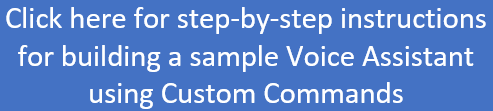

[](https://msasg.visualstudio.com/Skyman/_build/latest?definitionId=12256&branchName=master)

<!-- For above fields, see: https://review.docs.microsoft.com/en-us/help/contribute/samples/process/onboarding?branch=master#yaml-front-matter-structure  -->

# Microsoft Cognitive Services - Voice Assistant Sample Code

<!-- 
Guidelines on README format: https://review.docs.microsoft.com/help/onboard/admin/samples/concepts/readme-template?branch=master

Guidance on onboarding samples to docs.microsoft.com/samples: https://review.docs.microsoft.com/help/onboard/admin/samples/process/onboarding?branch=master

Taxonomies for products and languages: https://review.docs.microsoft.com/new-hope/information-architecture/metadata/taxonomies?branch=master
-->

## Overview

This repository includes everything needed to build a sample [Voice Assistant](https://docs.microsoft.com/en-us/azure/cognitive-services/speech-service/voice-assistants) hosted in your own Azure subscription, with a client application of your choice. Voice Assistants use Microsoft's [Speech SDK](https://docs.microsoft.com/en-us/azure/cognitive-services/speech-service/speech-sdk) in the client application to connect to [Direct Line Speech Channel](https://docs.microsoft.com/en-us/azure/cognitive-services/speech-service/direct-line-speech) and your [Bot-Framework](https://dev.botframework.com/) bot. Alternatively, Speech SDK can be used to connect to your [Custom Commands](https://docs.microsoft.com/en-us/azure/cognitive-services/speech-service/custom-commands) voice application. Voice Assistants can be [keyword activated](https://speech.microsoft.com/customkeyword) using keyword model files in this repository or new ones you create.
<p>&nbsp;</p>
<!-- The image says "Click here for step-by-step instructions for building a sample Voice Assistant using Custom Commands"-->
<p align="center">
<a href="docs/CreateSampleVoiceAssistant.md">

</a>
</p>
<p>&nbsp;</p>
You may also find the following 12-minute overview video useful:

<p align="center">
<a href="https://www.youtube.com/watch?v=1zr0umHGFyc">

</a>
</p>

If you are writing a Bot-Framework bot, read the tutorial [Voice-enable your bot using the Speech SDK](https://docs.microsoft.com/azure/cognitive-services/speech-service/tutorial-voice-enable-your-bot-speech-sdk), and use sample clients in this repo to help you get started.

Or just browse individual components per the repository content below.

<!--
The repo has sample clients in C++, C# and Java, samples of [Voice Assistant](https://docs.microsoft.com/en-us/azure/cognitive-services/speech-service/voice-assistants) clients for different platforms. It also includes a client tool for end-to-end regression testing of a Voice Assistant system.
Sample code for building Voice Assistant clients, using Microsoft's Speech SDK and Direct Line Speech channel, including Custom Command
0-->

## Repository Content

### Sample Client Applications

| Folder | Description | Language/Platform |
|-------------|-------------|-------------------|
| [clients](https://github.com/Azure-Samples/Cognitive-Services-Voice-Assistant/tree/master/clients) | Landing page for sample clients |
| [clients\csharp-uwp](https://github.com/Azure-Samples/Cognitive-Services-Voice-Assistant/tree/master/clients/csharp-uwp) |  UWP voice assistant client sample. An example UWP app that uses Window's new voice activation APIs, together with the Voice Assistant platform, to connect to your bot or Custom Commands application. | C#, Universal Windows Platform (UWP) |
| [clients\csharp-wpf](https://github.com/Azure-Samples/Cognitive-Services-Voice-Assistant/tree/master/clients/csharp-wpf) |  Windows voice assistant client sample. Generic Windows tool to manually test your bot or Custom Commands application | C#, Windows Presentation Foundation (WPF) |
| [clients\cpp-console](https://github.com/Azure-Samples/Cognitive-Services-Voice-Assistant/tree/master/clients/cpp-console) | Console client sample for Smart Speaker devices, configured via a json file to connect to your bot or Custom Commands application. It supports microphone input and audio playback. Build scripts for [Raspberry Pi](https://www.raspberrypi.org/), [GGEC Speaker](http://www.ggec.com/) and Windows are provided | C++, Windows, Linux |
| [clients\java-android](https://github.com/Azure-Samples/Cognitive-Services-Voice-Assistant/tree/master/clients/java-android) | An Android application (phone or tablet) configured to connect to your bot or Custom Commands application | Java Android

### Sample Custom Commands and Scripts

| Folder | Description |
|-------------|-------------|
| [custom-commands\demos](https://github.com/Azure-Samples/Cognitive-Services-Voice-Assistant/tree/master/custom-commands/demos)| Landing page for Custom Command demos, including deployment instructions |
| [custom-commands\demos\hospitality](https://github.com/Azure-Samples/Cognitive-Services-Voice-Assistant/tree/master/custom-commands/demos/hospitality)| Sample voice commands to control your room (lights, blinds, TV and temperature), including visualization of the results in a hotel room settings |
| [custom-commands\demos\inventory](https://github.com/Azure-Samples/Cognitive-Services-Voice-Assistant/tree/master/custom-commands/demos/inventory) | Sample voice commands to control warehouse inventory (adding or removing different color crates), including visualization of the results |
| [custom-commands\demos\automotive](https://github.com/Azure-Samples/Cognitive-Services-Voice-Assistant/tree/master/custom-commands/demos/automotive) | Sample voice commands to the environment in your car (temperature, .... ), including visualization of the results |
| [custom-commands\demos\careroom](https://github.com/Azure-Samples/Cognitive-Services-Voice-Assistant/tree/master/custom-commands/demos/careroom)| Sample voice commands to control your room (lights, blinds, TV and temperature), including visualization of the results in a hospital room or other healthcare facility |
| [custom-commands\quick-start](https://github.com/Azure-Samples/Cognitive-Services-Voice-Assistant/tree/master/custom-commands/quick-start) | JSON Custom Command file for the [official quick-start guide](https://docs.microsoft.com/en-us/azure/cognitive-services/speech-service/custom-commands)  |
| [custom-commands\scripts](https://github.com/Azure-Samples/Cognitive-Services-Voice-Assistant/tree/master/custom-commands/scripts) | Continuous deployment scripts for Azure DevOps pipeline |


### Sample Keyword Models

| Folder | Description |
|-------------|-------------|
| [keyword-models](https://github.com/Azure-Samples/Cognitive-Services-Voice-Assistant/tree/master/keyword-models)| A few keyword models (.table files) for you to try out. Or you can create your own -- See [Create a custom keyword using Speech Studio](https://docs.microsoft.com/en-us/azure/cognitive-services/speech-service/speech-devices-sdk-create-kws) |

### Test Code

| Folder | Description | Language/Platform |
|-------------|-------------|-------------------|
| [clients\csharp-dotnet-core\voice-assistant-test](https://github.com/Azure-Samples/Cognitive-Services-Voice-Assistant/tree/master/clients/csharp-dotnet-core/voice-assistant-test) | Automated, multi-turn, end-to-end regression test for your bot or Custom Commands application. Supports WAV file input, text or Bot-Framework activities | C# .NET Core  |

### Articles

| File | Description |
|-------------|-------------|
| [docs\CloudConnectionLogic.md](docs/CloudConnectionLogic.md)| Discusses options for when to connect to Direct Line Speech channel and how long to keep the connection open  |
| [docs\LocalBot.md](docs/LocalBot.md)| Running & debugging your Bot locally while using Direct Line Speech Channel |

### Root Folder Files

| File | Description | Language/Platform |
|-------------|-------------|-------------------|
| `.gitignore`         | Define what to ignore at commit time
| `CODE_OF_CONDUCT.md` | Code of Conduct for all Microsoft repositories
| `CONTRIBUTING.md`    | Guidelines for contributing to these samples
| `README.md`          | This README file
| `LICENSE.md`         | The license for these samples
| `SECURITY.md`        | Information about reporting any security vulnerabilities to Microsoft
| `NOTICE.txt`         | License of third party software incorporated in these samples
<!--
## Prerequisites

Outline the required components and tools that a user might need to have on their machine in order to run the sample. This can be anything from frameworks, SDKs, OS versions or IDE releases.

## Setup

Explain how to prepare the sample once the user clones or downloads the repository. The section should outline every step necessary to install dependencies and set up any settings (for example, API keys and output folders).

## Runnning the sample

Outline step-by-step instructions to execute the sample and see its output. Include steps for executing the sample from the IDE, starting specific services in the Azure portal or anything related to the overall launch of the code.

## Key concepts

Provide users with more context on the tools and services used in the sample. Explain some of the code that is being used and how services interact with each other.
-->
## Clone the Repo

To build any of the sample client applications or deploy custom commands to your Azure subscription, you will first need to clone this GitHub repository:

```bash
    git clone https://github.com/Azure-Samples/Cognitive-Services-Voice-Assistant.git
    cd Cognitive-Services-Voice-Assistant
```

## Related Microsoft GitHub Repos
* https://github.com/Azure-Samples/cognitive-services-speech-sdk
* https://github.com/Azure-Samples/Cognitive-Services-Speech-Devices-SDK
* https://github.com/microsoft/botframework-solutions
* https://github.com/Microsoft/BotBuilder-Samples

## Contributing

This project welcomes contributions and suggestions.  Most contributions require you to agree to a
Contributor License Agreement (CLA) declaring that you have the right to, and actually do, grant us
the rights to use your contribution. For details, visit https://cla.opensource.microsoft.com.

When you submit a pull request, a CLA bot will automatically determine whether you need to provide
a CLA and decorate the PR appropriately (e.g., status check, comment). Simply follow the instructions
provided by the bot. You will only need to do this once across all repos using our CLA.

This project has adopted the [Microsoft Open Source Code of Conduct](https://opensource.microsoft.com/codeofconduct/).
For more information see the [Code of Conduct FAQ](https://opensource.microsoft.com/codeofconduct/faq/) or
contact [opencode@microsoft.com](mailto:opencode@microsoft.com) with any additional questions or comments.

## Reporting Security Issues
Security issues and bugs should be reported privately, via email, to the Microsoft Security Response Center (MSRC) at [secure@microsoft.com](mailto:secure@microsoft.com). You should receive a response within 24 hours. If for some reason you do not, please follow up via email to ensure we received your original message. Further information, including the [MSRC PGP](https://technet.microsoft.com/en-us/security/dn606155) key, can be found in the [Security TechCenter](https://technet.microsoft.com/en-us/security/default).

Copyright (c) Microsoft Corporation. All rights reserved.
