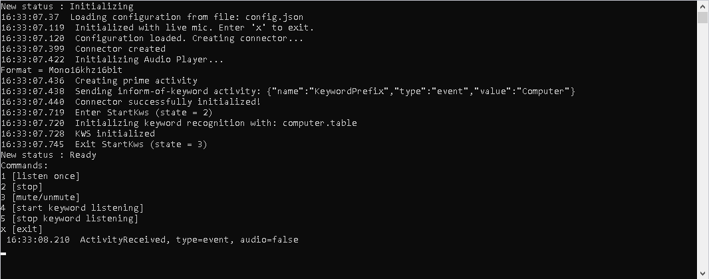

# Microsoft Cognitive Services - Voice Assistant C++ Console Sample

## Overview

This sample is intended to be a starting point for any application coded in c++. It has some generic files that implement an IAudioPlayer interface for audio playback. This interface will be specific to the target OS and/or device. A sample player for linux devices is included.

## Prerequisites and Setup
* You will need a speech service subscription key and region. Instructions for creating one can be found on this [page](https://docs.microsoft.com/en-us/azure/cognitive-services/speech-service/tutorial-voice-enable-your-bot-speech-sdk) under "Create a resource group" and "Create resources"

* The [Microsoft Speech SDK](https://docs.microsoft.com/en-us/azure/cognitive-services/speech-service/speech-sdk) will need to be downloaded.

For Windows you should use the nuget package.

For Linux or ARM devices the build scripts will download and copy the SDK's newest version and the native binaries will be copied to the lib folder in this repo so that you have a structure like this (for ARM32): ./lib/arm32. 

Headers and their folders will be copied into the include folder so that you have a structure like this: ./include/cxx_api and ./include/c_api

Replace the text in the configs/config.json file with your subscription key and key region. If you are using a Custom Commands application or custom speech font you can insert those GUID's there as well.

## Build directly on Linux arm32

Check out the [RaspberryPi.md](docs/RaspberryPi.md) for detailed instructions.

## Building for Linux Arm32 with Docker

Check out the [GGECSpeaker.md](docs/GGECSpeaker.md) for detailed instructions.

## Building for Linux on a Windows machine

Check out how to [compile this C++ console sample for Linux on a Windows machine](docs/BuildForLinuxOnWindows.md)

## Building for Windows

Check out the [Windows.md](docs/Windows.md) for detailed instructions.

## Features

* Fully configurable to support bot registered with the Direct Line Speech channel or Custom Commands application
* Accepts recorded audio wav file or speech captured by a microphone as inputs
* Supports playback of audio response
* Supports use of [custom wake-words](https://docs.microsoft.com/en-us/azure/cognitive-services/speech-service/speech-devices-sdk-create-kws)
* Currently, the CPP console application supports 6 user inputs:

1. listen once – Enter 1 to start listening. The listening session will stop when detecting starts.
2. stop – Enter 2 to stop speaking.
3. mute/unmute – Enter 3 to mute/unmute when listening. This functionality is not implemented yet.
4. start keyword listening – Though keyword recognition starts automatically if a valid keyword is specified, enter 4 to start keyword listening if it is stopped later on.
5. stop keyword listening – Enter 5 to stop keyword listening.
6. exit – Enter x to exit this console application.