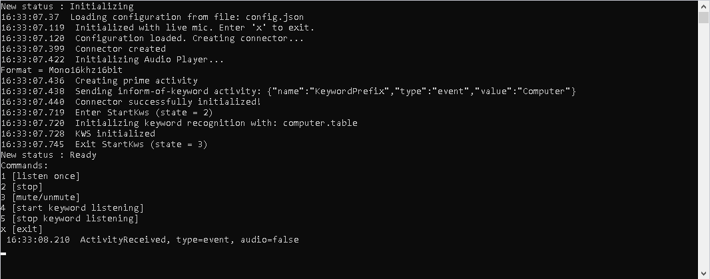

# Microsoft Cognitive Services - Voice Assistant C++ Console Sample - Windows Setup

## Overview

This readme describes how to build and run the C++ sample code on your Windows machine

## Requirements

You will need a Windows 10 PC with Visual Studio 2017 or higher.

## Build the code

1. Follow the instructions listed above to setup the building and running environment. Besides, get subscription key and key region ready at hand, along with app id if you are using a Custom Commands application.

2. Build the executable from source code:
* First clone the repository:
```cmd
git clone https://github.com/Azure-Samples/Cognitive-Services-Voice-Assistants.git
```
* Then change directories:
```cmd
cd Cognitive-Services-Voice-Assistants\clients\cpp-console\src\windows
```
* Open the Visual Studio solution **clients\cpp-console\src\windows\cppSample.sln** and build the solution (the default build flavor is Debug x64).
* Open a console Window in the project output folder, e.g. **clients\cpp-console\src\windows\x64\Debug** (for x64 debug build) and see the resulting executable **cppSample.exe** in that folder.

## Configure your client

Copy the example configuration file **clients\configs\config.json** into your project output folder and update it as needed. Fill in your subscription key and key region. If you are using a Custom Commands application or a Custom Voice insert those GUID's as well. The KeywordRecognitionModel should point to the Custom Keyword (.table file) being used. You can delete fields that are not required for your setup. Only the speech_subscription_key and speech_region are required.
```json
{
  "KeywordRecognitionModel": "",
  "Keyword": "",
  "SpeechSubscriptionKey": "speech_subscription_key",
  "SpeechRegion": "speech_region",
  "Volume": "25",
  "CustomCommandsAppId": "custom_commands_app_id",
  "CustomVoiceDeploymentIds": "",
  "SpeechSDKLogFile": "",
  "TTSBargeInSupported": "",
  "CustomMicConfigPath" :"",
  "LinuxCaptureDeviceName": ""
}
```

## Run the code

To run, type
```cmd
cppSample.exe config.json
```



Currently, the CPP console application supports 6 user inputs:
1. listen once – Enter 1 to start listening. The listening session will stop when detecting starts.
2. stop – Enter 2 to stop speaking.
3. mute/unmute – Enter 3 to mute/unmute when listening. This functionality is not implemented yet.
4. start keyword listening – Though keyword recognition starts automatically if a valid keyword is specified, enter 4 to start keyword listening if it is stopped later on.
5. stop keyword listening – Enter 5 to stop keyword listening.
6. exit – Enter x to exit this console application.


