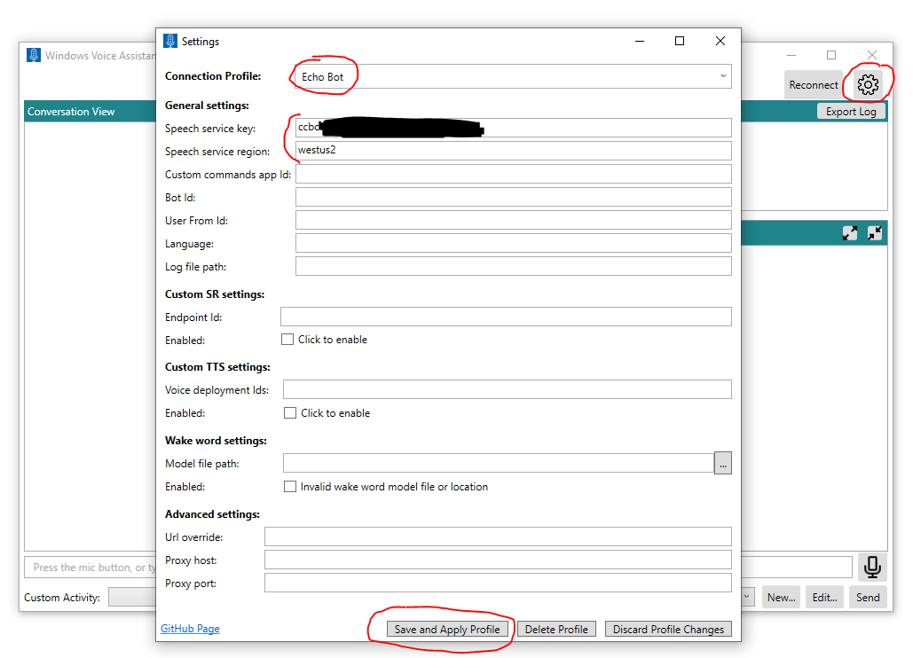
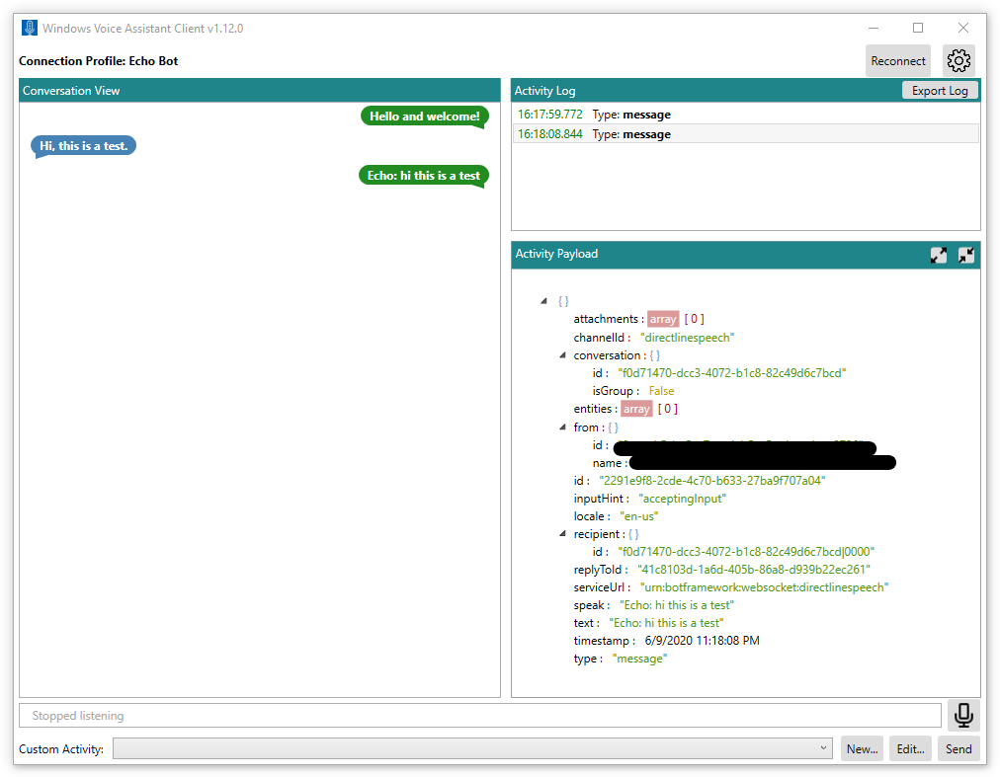

# Windows Voice Assistant Client

The Windows Voice Assistant Client is a Windows Presentation Foundation (WPF) application in C# that makes it easy to test interactions with your bot before creating a custom client application. It demonstrates how to use the [Azure Speech Services Speech SDK](https://docs.microsoft.com/azure/cognitive-services/speech-service/speech-sdk) to manage communication with your Azure Bot-Framework bot. To use this client, you need to register your bot with the [Direct Line Speech](https://docs.microsoft.com/en-us/azure/bot-service/bot-service-channel-connect-directlinespeech?view=azure-bot-service-4.0) channel. Windows Voice Assistant Client is used in the tutorial [Voice-enable your bot using the Speech SDK](https://docs.microsoft.com/en-us/azure/cognitive-services/speech-service/tutorial-voice-enable-your-bot-speech-sdk).

Following the introduction of [Custom Commands](https://docs.microsoft.com/en-us/azure/cognitive-services/speech-service/custom-commands) in Speech SDK 1.8, this tool was updated to accept a custom command application ID. This allows you to test your task completion or command-and-control scenario hosted on the Custom Command service.
<br></br>
> *Note: This sample replaces the "Direct Line Speech Client" that used to be hosted in the deprecated GitHub repo [Azure-Samples/Cognitive-Services-Direct-Line-Speech-Client](https://github.com/Azure-Samples/Cognitive-Services-Direct-Line-Speech-Client). Functionality is the same. The name was changed to Voice Assistant Client (or "Windows Voice Assistant Client"), to reflect the support for both Custom Commands applications as well as bots registered with Direct Line Speech channel. It has moved to this new repo to be in proximity to other voice assistant client sample code.*

## Features

* Fully configurable to support any bot registered with the Direct Line Speech channel or Custom Commands application
* Accepts typed text and speech captured by a microphone as inputs for your bot
* Supports playback of audio response
* Supports use of [custom wake-words](https://docs.microsoft.com/en-us/azure/cognitive-services/speech-service/speech-devices-sdk-create-kws)
* Supports sending custom [Bot-Framework Activities](https://github.com/Microsoft/botframework-sdk/blob/master/specs/botframework-activity/botframework-activity.md) as JSON to the bot
* Displays [Adaptive Cards](https://adaptivecards.io/) sent from your bot. On the client we implement the .NET WPF version of the [adaptive card SDK](https://docs.microsoft.com/en-us/adaptive-cards/sdk/rendering-cards/net-wpf/getting-started)
* Exports the transcript and activity logs to a file

## Getting Started

### Prerequisites
Let's review the hardware, software, and subscriptions that you'll need to use this client application.

- Windows 10 PC
- Visual Studio 2017 or higher
- [.NET Framework Runtime 4.6.1](https://dotnet.microsoft.com/download) or higher if you just want to download and run the executable, or [.NET Framework Dev Pack 4.6.1](https://dotnet.microsoft.com/download) or higher if you want to clone the repo and build the executable from source code 
- Microphone access
- An Azure [Speech Services Key](https://docs.microsoft.com/en-us/azure/cognitive-services/speech-service/get-started)
- A [Bot-Framework](https://dev.botframework.com/) bot service registered with [Direct Line Speech](https://docs.microsoft.com/en-us/azure/bot-service/bot-service-channel-connect-directlinespeech?view=azure-bot-service-4.0) channel

### Quickstart
1. To download and run a pre-build executable:
    - Go to the [Releases section of this GitHub repo](https://github.com/Azure-Samples/Cognitive-Services-Voice-Assistant/releases)
    - Look for the latest release named "Windows Voice Assistant Client". Each release has a tag in the form of YYYYMMDD.# indicating the build date
    - Download the latest ZIP package named WindowsVoiceAssistantClient-YYYYMMDD.#.zip, and unpack it to a local drive. 
    - Run the executable VoiceAssistantClient.exe
    
1. Alternatively, to build the executable from source code:
    - The first step is to clone the repository:
   ```bash
   git clone https://github.com/Azure-Samples/Cognitive-Services-Voice-Assistants.git
   ```
    -  Then change directories:
   ```bash
   cd Cognitive-Services-Voice-Assistants\clients\csharp-wpf
   ```
    -  Launch Visual Studio 2017 or newer by opening the solution `VoiceAssistantClient.sln`. Build the solution (the default build flavor is Debug x64)
    - Run the executable. For example, for Debug x64 build, this will be the executable: `VoiceAssistantClient\bin\x64\Debug\VoiceAssistantClient.exe`.
1. When you first run the application, the **Settings** page will open. If this is not the first time you run the application, click on the gears icon on the top right to access the settings page. The first three fields are required (all others are optional). 
    - Enter _Connection Profile_. A name of your choice to identify this connection. The tool remembers multiple connection profiles so you can easily switch between them.
    - Enter _Subscription key_. This is your Azure [Speech Services Key](https://docs.microsoft.com/en-us/azure/cognitive-services/speech-service/get-started).
    - Enter _Subscription key region_. This is the Azure region of your key in the format specified by the "Speech SDK Parameter" column [in this table](https://docs.microsoft.com/en-us/azure/cognitive-services/speech-service/regions#speech-to-text-text-to-speech-and-translation) (for example "westus").
    - Leave the field _Custom commands app Id_ empty (unless you plan to use [Custom Commands](#use-custom-commands)).
    - The default input language is "en-us" (US English). Update the _Language_ field as needed to select a different [language code from the "Speech-to-text" list](https://docs.microsoft.com/en-us/azure/cognitive-services/speech-service/language-support).
    - Press _Save and Apply Profile_ when you're done.
    - Your entries will be saved under this profile name and will be available when you launch the app again.
  
1. Press **Reconnect**. The application will try to connect to your bot via Direct Line Speech channel, and your connection profile name will
be shown at the top. The message **New conversation started -- type or press the microphone button** will appear below the text bar if the connection succeeded.

1. You'll be prompted to allow microphone access. If you want to use the microphone, allow access.
1. Press the microphone icon to begin recording. While speaking, intermediate recognition results will be shown in the application. The microphone icon will turn red while recording is in progress. It will automatically detect end of speech and stop recording.
1. If everything works, you should see your bot's response on the screen and hear it speak the response. You can click on lines in the **Activity Log** window to see the full activity payload from the bot in JSON.
    **Note**: You'll only hear the bot's voice response if the [**Speak** field](https://github.com/Microsoft/botframework-sdk/blob/master/specs/botframework-activity/botframework-activity.md#speak) in the bot's output activity was set.


## Troubleshooting

If an error messages was shown in red in the main application window, use this table to troubleshoot:
| Error | What should you do? |
|-------|----------------------|
|Error (AuthenticationFailure) : WebSocket Upgrade failed with an authentication error (401). Please check for correct subscription key (or authorization token) and region name| In the Settings page of the application, make sure you entered the Speech Subscription key and its region correctly.|
|Error (ConnectionFailure) : Connection was closed by the remote host. Error code: 1011. Error details: We could not connect to the bot before sending a message | Make sure you [checked the "Enable Streaming Endpoint" box and/or toggled "Web sockets" to On](https://docs.microsoft.com/en-us/azure/bot-service/bot-service-channel-connect-directlinespeech?view=azure-bot-service-4.0#enable-the-bot-framework-protocol-streaming-extensions)<br>Make sure your Azure App Service is running. If it is, try restarting your App Service.|
|Error (ConnectionFailure) : Connection was closed by the remote host. Error code: 1002. Error details: The server returned status code '503' when status code '101' was expected | Make sure you [checked the "Enable Streaming Endpoint" box and/or toggled "Web sockets" to On](https://docs.microsoft.com/en-us/azure/bot-service/bot-service-channel-connect-directlinespeech?view=azure-bot-service-4.0#enable-the-bot-framework-protocol-streaming-extensions)<br>Make sure your Azure App Service is running. If it is, try restarting your App Service.|
|Error (ConnectionFailure) : Connection was closed by the remote host. Error code: 1011. Error details: Response status code does not indicate success: 500 (InternalServerError)| Your bot specified a Neural Voice in its output Activity [Speak](https://github.com/microsoft/botframework-sdk/blob/master/specs/botframework-activity/botframework-activity.md#speak) field, but the Azure region associated with your Speech subscription key does not support Neural Voices. See [Standard and neural voices](https://docs.microsoft.com/en-us/azure/cognitive-services/speech-service/regions#standard-and-neural-voices).|


See also _Debugging_ section in [Voice-first virtual assistants Preview: Frequently asked questions](https://docs.microsoft.com/en-us/azure/cognitive-services/speech-service/faq-voice-first-virtual-assistants#debugging)

### A note on connection time out

If you are connected to a bot or custom command application and no activity happened in the last 5 minutes, the service will automatically close the websocket connection with the client and with the bot. This is by design. A message will appear in the bottom bar: *"Active connection timed out but ready to reconnect on demand"*. You do not need to press the "Reconnect" button - simply press the microphone button and start talking, type in a text message, or say the keyword (if one is enabled). The connection will automatically be reestablished.  

## Sending custom activities to your bot

Windows Voice Assistant Client allows you to author and send a custom JSON activity to your bot. This is done using the "Custom Activity" bar at the bottom of the main window and the "New", "Edit" and "Send" buttons. Enter a valid JSON format that conforms to the Bot-Framework Activity schema. An example is given in the file [example.json](docs/json/example.json).

## Add custom keyword activation

See section [Add custom keyword activation](https://docs.microsoft.com/en-us/azure/cognitive-services/speech-service/tutorial-voice-enable-your-bot-speech-sdk#add-custom-keyword-activation) in the tutorial.

## Use custom speech-recognition (SR) endpoint

The [Speech Studio Portal](https://speech.microsoft.com/portal/) allows you to create [Custom Speech](https://docs.microsoft.com/en-us/azure/cognitive-services/speech-service/how-to-custom-speech) in order to build, analyze, and deploy custom speech recognition models. The portal will provide an "Endpoint ID" (a GUID). Enter this GUID in the "Endpoint Id" field in the settings page (under "Custom SR settings"), and check the "Enabled" box below it to have it used. Direct Line Speech channel will use your custom SR endpoint to transcribe voice.

## Use custom text-to-speech (TTS) voice

The [Speech Studio Portal](https://speech.microsoft.com/portal/) allows you to create a [Custom Voice](https://docs.microsoft.com/en-us/azure/cognitive-services/speech-service/how-to-custom-voice-create-voice), where you can record and upload training data to create a unique voice font for your applications. The portal will provide a deployment ID (a GUID). Enter this GUID in the "Voice deployment Ids" field in the settings page (under "Custom TTS settings"), and check the "Enabled" box below it to have it used. Direct Line Speech channel will use your custom TTS endpoint to create the bot's voice response. Note that the "speak" field in the bot's reply Activity must contain the name of the voice you created in the portal.

## Use custom commands

If you built your dialog using the [Custom Commands](https://docs.microsoft.com/en-us/azure/cognitive-services/speech-service/custom-commands) service (instead of a Bot-Framework bot registered with Direct Line Speech channel), enter your custom commands application ID in the setting page ("custom commands app id"). This client application will connect to the custom commands service that hosts your dialog.

## Use adaptive cards

If your bot sends down adaptive cards, the client will display them and you will be able to click on the cards and the data from the action will be displayed in a message box. If you would like to send responses back to the bot, you will have to change the code to call the SendActivityAsync() API. This is done by implementing the Action.Submit feature of the adaptive cards defined here: [Action.Submit](https://adaptivecards.io/explorer/Action.Submit.html)
</br> </br>
The code to override is in the RenderedCard_OnAction method.
Here is an example of how to send a message back:

    var botFrameworkActivity = Activity.CreateMessageActivity();
    botFrameworkActivity.Text = submitAction.Data.ToString();
    if (!string.IsNullOrEmpty(FromId))
    {
        botFrameworkActivity.From = new ChannelAccount(this.settings.RuntimeSettings.Profile.FromId);
    }

    var jsonConnectorActivity = JsonConvert.SerializeObject(botFrameworkActivity);
    this.Messages.Add(new MessageDisplay(botFrameworkActivity.Text, Sender.User));
    this.Activities.Add(new ActivityDisplay(jsonConnectorActivity, botFrameworkActivity, Sender.User));
    string id = this.connector.SendActivityAsync(jsonConnectorActivity).Result;
    Debug.WriteLine($"SendActivityAsync called, id = {id}");

## Resources
- [Bot Framework](https://dev.botframework.com/) docs:
  - [About Direct Line](https://docs.microsoft.com/en-us/azure/bot-service/bot-service-channel-directline?view=azure-bot-service-4.0)
  - [Connect a bot to Direct Line Speech](https://docs.microsoft.com/en-us/azure/bot-service/bot-service-channel-connect-directlinespeech?view=azure-bot-service-4.0)
  - [Use Direct Line Speech in your bot](https://docs.microsoft.com/en-us/azure/bot-service/directline-speech-bot?view=azure-bot-service-4.0)
  - [Bot-Framework Activities](https://github.com/Microsoft/botframework-sdk/blob/master/specs/botframework-activity/botframework-activity.md)
  - [Azure Bot Service pricing](https://azure.microsoft.com/en-gb/pricing/details/bot-service/)
- [Speech SDK](https://docs.microsoft.com/en-us/azure/cognitive-services/speech-service/speech-sdk) docs:
  - [About voice assistants](https://docs.microsoft.com/en-us/azure/cognitive-services/Speech-Service/voice-assistants)
  - [Tutorial: Voice-enable your bot using the Speech SDK](https://docs.microsoft.com/en-us/azure/cognitive-services/speech-service/tutorial-voice-enable-your-bot-speech-sdk)
  - [What is custom Speech?](https://docs.microsoft.com/en-us/azure/cognitive-services/speech-service/how-to-custom-speech)
  - [Create a custom voice](https://docs.microsoft.com/en-us/azure/cognitive-services/speech-service/how-to-custom-voice-create-voice)
  - [Create a custom wake word by using the Speech service](https://docs.microsoft.com/en-us/azure/cognitive-services/speech-service/speech-devices-sdk-create-kws)
  - [Try Speech Services for free](https://docs.microsoft.com/en-us/azure/cognitive-services/speech-service/get-started)
  - [Language and region support for the Speech Services](https://docs.microsoft.com/en-us/azure/cognitive-services/speech-service/language-support)
  - [Speech Service supported regions](https://docs.microsoft.com/en-us/azure/cognitive-services/speech-service/regions)
  - [Speech Synthesis Markup Language (SSML)](https://docs.microsoft.com/en-us/azure/cognitive-services/speech-service/speech-synthesis-markup)
- [Adaptive Cards](https://adaptivecards.io/)
