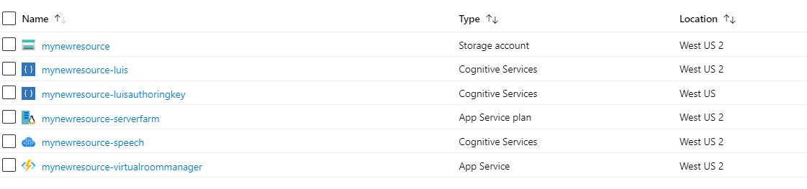

This README is under development and not guaranteed to be accurate or functional.

## Things you will need
* An Azure subscription. [Azure](https://portal.azure.com)
* Powershell 6.0 or greater [Download Powershell](https://github.com/PowerShell/PowerShell/releases)

## Deploying Azure Resources
1. Click the button below: 

2. A new window should pop up that prompts you to log into your Azure account. 

3. Once logged in, you should see a page similar to this. Select the subscription you want to use. I have chosen to create a new resource group titled "CognitiveServices12345" and selected West US 2 for the Location. Decide on a "Resource Name" for your resources. This will be prepended to the names of the resources created. Keep track of this name as we will use it later. 

4. Check the box to agree to the terms and conditions

5. Click "Purchase"

6. You're resources should be deployed after a minute or two.

7. You should now have a resource group and some resources underneath it. 
Here is what mine looks like:
 
You'll notice how the resource name was used.
You will also need the following strings to use further down.
    * LUIS authoring key.
    * speech subscription key.
    * azure subscription key. - look for Subscriptions in Azure and you should be able to find it.
    * website for task completion. In our case this is the hospitality room website.
    

## Deploying your Custom Commands Application
1. Open a powershell window and cd into the deployment directory
2. run .\createSpeechApp.ps1 with the following parameters:
* -speechResourceKey YOUR_SPEECH_SUBSCRIPTION_KEY
* -resourceName RESOURCENAME_USED_IN_DEPLOYING
* -azureSubscriptionId AZURE_SUBSCRIPTION_ID 
* -luisAuthoringKey LUIS_AUTHORING_KEY
* -websiteAddress WEBSITE_FOR_TASK_COMPLETION
* -resourceGroup RESOURCE_GROUP

It should look something like this:

    .\createSpeechApp.ps1 -speechResourceKey YOUR_SPEECH_SUBSCRIPTION_KEY -websiteAddress WEBSITE_FOR_TASK_COMPLETION -resourceName RESOURCENAME_USED_IN_DEPLOYING -azureSubscriptionId AZURE_SUBSCRIPTION_ID  -luisAuthoringKey LUIS_AUTHORING_KEY -resourceGroup RESOURCE_GROUP

Once complete you will be able to see your new Custom Commands application in the [Speech Studio](https://speech.microsoft.com) by selecting your "Speech Resource". In the example above it would be MyNewResources-speech. Click on "Go To Studio" and then "Custom Commands".