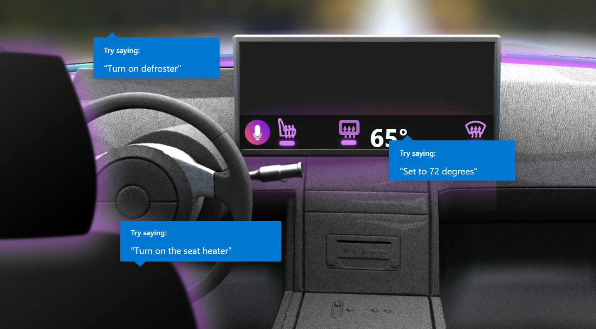

# Automotive - A Custom Commands Demo

## Domain

In this demo we simulate a warehouse with inventory (boxes with different colors and sizes). We use voice to control removing or adding boxes, or query the inventory.

## Example sentences

Here are a few examples. Try these or others of your choice:
* 

If you configured your client application to listen for a keyword, say the keyword first followed by the above (or other) sentences (e.g. "computer, turn on the lights")

## Links

* To deploy this demo, follow the [step-by-step instructions for building a sample Voice Assistant using Custom Commands](../../docs/CreateSampleVoiceAssistant.md)
* View the Custom Commands [JSON file](skill/AutomotiveDemo.json) for this demo