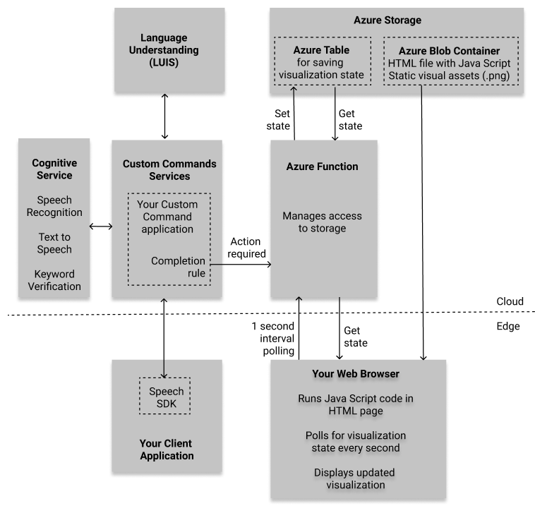
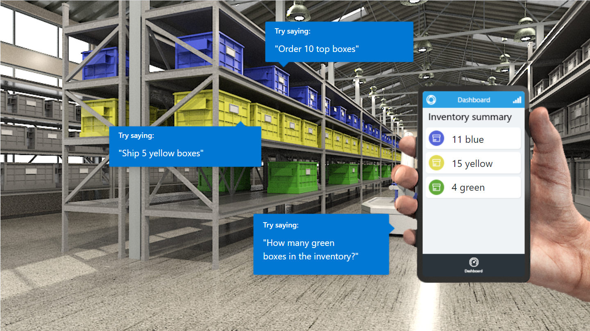
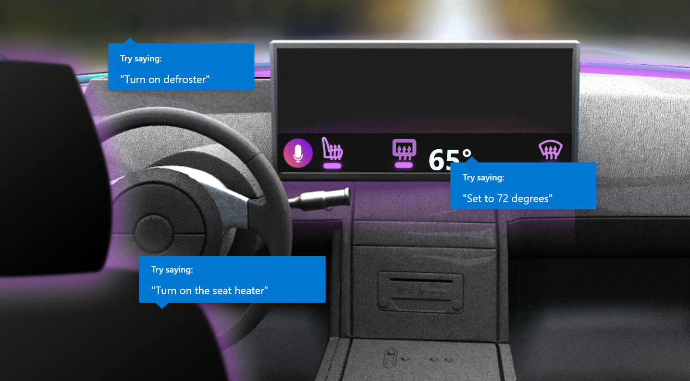
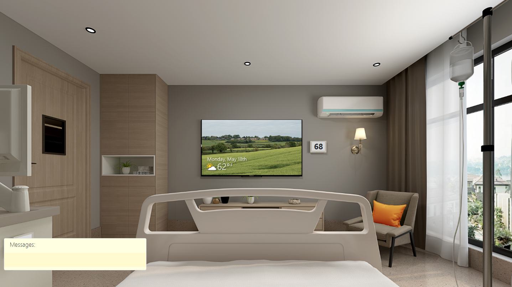

# Deploying a Sample Custom Command Application to Your Azure Subscription

## Things you will need
* An Azure account. [Sign up for free](https://azure.microsoft.com/free/ai/).
* Powershell 6.0 or greater. [Download Powershell here](https://github.com/PowerShell/PowerShell/releases). 
    * On Windows, download and run an .msi file (e.g. "PowerShell-7.0.0-win-x64.msi")
* Azure CLI. [Insall Azure CLI](https://docs.microsoft.com/en-us/cli/azure/install-azure-cli?view=azure-cli-latest) version 2.4.0 or higher.
* .NET Core SDK 2.1 [Install SDK here](https://docs.microsoft.com/en-us/dotnet/core/install/sdk?pivots=os-windows).

## What are you deploying?

You will be deploying a sample [Custom command](https://docs.microsoft.com/en-us/azure/cognitive-services/speech-service/custom-commands) project in your [Speech Studio](https://speech.microsoft.com/portal) portal. To demonstrate successful task completion (e.g. lights have turned off when you said "lights off"), we created a web page with a simulated scene. The completion rules in the Custom Command project are configured to make web calls to an Azure function that manages the state of the scene. Therefore in addition to the Custom Command project, you will be deploying all the Azure resources needed to support this visualization, in your Azure subscription.

The following block diagram describes how the demo works: 
<p align="center">

</a>
</p>
We assume that you read about Custom Commands and Speech SDK client applications, so here we only describe the visualization part:

* An Azure Blob storage is created, which holds an HTML file and associated images needed to visualize all the states of the scene 
* You can view the HTML file in your web browser, since it has a unique URL. It will show the default scene at first
* An Azure function is created. It has access to the storage. When your Custom Command project completed a dialog (e.g. "turn on the lights"), its completion rule directs it to make a web call invoking the Azure function. The web call includes the desired new scene state (e.g. lights are on)
* The Azure function updates a row in the Azure Table in storage (or creates the row on first call), to hold the new scene state
* While all that is happening, the Java Script embedded in the HTML page you are viewing, runs and periodically makes calls to the same Azure function to get the most recent scene state. In this demo the period is set to 1 second
* If the state has changed, the Java Script code in the HTML builds the new visualization to reflect the current state, using the static images in storage

If all that sounds good, continue on to deploy the resources to your Azure subscription.

## Deploying Azure resources
Open a command prompt and clone the repository if you have not done so already. Change directory to the Custom Commands scripts folder:
```cmd
    git clone https://github.com/Azure-Samples/Cognitive-Services-Voice-Assistant.git
    cd Cognitive-Services-Voice-Assistant\custom-commands\demos\scripts
```

Open a Powershell 6.0 or higher administrator prompt. You will need to unrestrict Powershell's script execution policy by running the following in an administrator Powershell:
```powershell
    Set-ExecutionPolicy -Scope Process -ExecutionPolicy Bypass
```
This will reset the policy once this Powershell session has ended.

Run the following command to log your Powershell into Azure. If you have more than one Azure login credentials, you will be prompted to selected one of them:
```powershell
    az login
```
If you have more than one Azure subscription associated with this Azure account, the default one will be used. You can view your subscriptions and [Change the active subscription](https://docs.microsoft.com/en-us/cli/azure/manage-azure-subscriptions-azure-cli#change-the-active-subscription) at this point if you like, before continuing on.

Run the Powershell script below, with the following arguments:
 * Replace "DemoName" with one of three available values: [hospitality](hospitality/README.md), [inventory](inventory/README.md), [automotive](automotive/README.md) or [careroom](careroom/README.md). Click on those links to get a description of the supported dialog and the virtual scene.
 * Replace "Language" with one of the supported languages (culture) codes of the selected demo. The only value supported at the moment is en-us.
 * Replace "MyResourceGroupName" with the an Azure Resource Group name of your choice. This name should be no more than 19 characters, alphanumeric only. Make sure an Azure resource group by this name does not already exist in your subscription. This name will also be used to construct names of all the Azure resources and URL that will be associated with this Custom Commands application and visualization. Some of these names need to be globally unique, so the script will append a random number to the name you selected
 * Replace "AzureRegion" with an Azure region near you, from the list of [Voice Assistant supported regions](https://docs.microsoft.com/en-us/azure/cognitive-services/speech-service/regions#voice-assistants) (e.g. westus). Read more about Azure Regions [here](https://azure.microsoft.com/en-us/global-infrastructure/regions/). Note that if you are using a free trial Azure subscription, you are limited to Azure regions westus or northeurope
```powershell
    ./deployAll.ps1 -appName DemoName -language Language -resourceName MyResourceGroupName -region AzureRegion
```
For example:
```powershell
    ./deployAll.ps1 -appName hospitality -language en-us -resourceName HospitalityDemo -region westus
```
When you run the above, it will first display information derived from the above parameters, and will ask you to enter 'y' to proceed, or any other character to quit.

The script may take a few minutes to run.

If you see errors while running the script, refer to the [Troubleshooting](#troubleshooting) section below. Before running the script again due to errors, please [clean up your Azure resources and Github repo state](#cleaning-up-your-azure-resources-and-github-repo).

On a successful completion, you should see a message at the end similar to the following, with all the information you need to configure one of the selected [Voice Assistant client samples](https://github.com/Azure-Samples/Cognitive-Services-Voice-Assistant#sample-client-applications), and a URL to visualize the results of your voice commands:
```console
*******************************************************************

 Your Custom Commands demo has been published!

 Customized your client app with the following, in order to connect:
    CustomCommandsAppId   = ########-####-####-####-############
    SpeechSubscriptionKey = ################################
    SpeechRegion          = westus

 To visualize the demo scene, point your browser to this address:
    https://#########.blob.core.windows.net/www/hospitality.html?room=test1

*******************************************************************
```
Copy the above information and store it for later use (but you can always [retrieve it if needed](#retrieving-client-connection-information-and-visualization-URL))

If you now look at your [Azure Resource groups](https://portal.azure.com/#blade/HubsExtension/BrowseResourceGroups) in the Azure portal, you will see a new resource group has been created with the name you selected, with these 6 resources in it:

| Name  | Type          | Usage
| ------- | ---------------- | --- |
| MyResourceGroupName-####             | Function App       | Required to host the Azure function
| MyResourceGroupName-authoring-####   | Cognitive Services | LUIS authoring. API type "Language Understanding Authoring (LUIS)"
| MyResourceGroupName-prediction-####  | Cognitive Services | LUIS runtime (aka "prediction"). API type "Language Understanding (LUIS)"
| MyResourceGroupName-serverfarm       | App Service Plan   | Required to host the Azure function
| MyResourceGroupName-speech           | Cognitive Services | Speech resource, where you get the speech subscription key
| MyResourceGroupName####              | Storage account    | Stores HTML and supporting .png files for scene visualization

## Make sure the visualization works properly

If you enter the visualization URL in your browser (```https://myresourcegroupname####.blob.core.windows.net/www/demo.html?room=test1```) you will see a default scene, simulating an environment you will soon manipulate with your voice.

For the Hospitality demo, you should see something similar to this scene:
<p align="center">

</p>

For the Inventory demo:
<p align="center">

</p>

For the Automotive demo:
<p align="center">

</p>

For the Care Room demo:
<p align="center">

</p>

## See your Custom Command application in Speech Studio

* Open [Speech Studio](http://speech.microsoft.com)
* Click on "Sign in" on the top right if you are not already signed in. Make sure you use the same Azure account you used to login from the Powershell script
* If you're prompted to select directory (Azure Active Directory for identity and access management), select the "Default Directory"
* If you're prompted to select a speech resource (*"Speech resources created on Azure are listed below. Choose one to begin a Speech Studio project"*), select the one named MyResourceGroupName-speech, which was created when you run the Powershell script. Then click on "Go to Studio".
* In the main Speech Studio page, go down to the bottom of the page and click on the "Custom Commands" box
* You should now see the newly created Custom Command project named MyResourceGroupName-commands, similar to the following:


Click on the project to open the Custom Command editor and have a look at the commands defined there. For more information about Custom Commands, see the "Develop with Custom Command" links in the [Voice Assistant documentation](https://docs.microsoft.com/en-us/azure/cognitive-services/speech-service/index-voice-assistants).

## Troubleshooting
The following are some common errors seen while executing the script:
* *<p style='color:red'>"The subscription '########-####-####-####-############' is disabled and therefore marked as read only. You cannot perform any write actions on this subscription until it is re-enabled.
Write-Error: Failed to create resource group"</p>* - This may be because your free trial period for Azure subscription has ended. Upgrade your subscription.
* *<p style='color:red'>"The template deployment 'azuredeploy' is not valid according to the validation procedure... See inner errors for details.... Operation failed. Only one free account is allowed for account type 'SpeechServices'....  Write-Error: Failed to deploy template"</p>* - The script uses the Azure free tier (F0) when deploying Cognitive Service Azure resources. In this tier there can only be one Speech resource per subscription. If you already deployed one Custom Command demo, and you are running the script again with a different resource group name, you will get this error. There are two ways to fix this:
  * [Delete the first Azure resource group](#cleaning-up-your-azure-resources-and-github-repo) before running another deployment script if you don't need both, or
  * Find the line ```"kind": "SpeechServices"``` in the file ```azuredeploy.json``` and change F0 to S0 above it. This will remove the limitation of single speech resource per subscription, but you may be charged for it.
* *<p style='color:red'>"You do not have the required permissions needed to perform this operation.
Depending on your operation, you may need to be assigned one of the following roles:
    "Storage Blob Data Contributor"
    "Storage Blob Data Reader" ... Container upload command failed. Retrying in 30 seconds. Sometimes it takes a while for the permissions to take effect."</p>* - This is common but usually does not mean the script has failed. The script has a retry policy, so you may see this message more than once, but eventually this operation should succeed and you will see *"Uploading files to new container ... Uploading files completed!"*. Okay to ignore the error in this case. We are working to change the script to avoid showing this error.

## Retrieving client connection information and visualization URL

The values below were displayed when the deployment script finished running successfully. If you need to retrieve them, follow the instructions below.

These three values are needed in order to configure a [client application](https://github.com/Azure-Samples/Cognitive-Services-Voice-Assistant#sample-client-applications) to connect to the Custom Command service.:

* Speech subscription key and key region
    * Find the relevant [Azure resource group](https://portal.azure.com/#blade/HubsExtension/BrowseResourceGroups) and click on it to see all the resources in the group
    * There will be one resource named MyResourceGroupName-speech (of type Cognitive Services). Notice its region. Click on the resource name.
    * Click on "Keys and Endpoints" on the left menu. The value shown as "KEY 1" is the speech subscription key.  
* Custom Commands Application ID
    * [Log into the relevant Custom Command project](#see-your-custom-command-application-in-speech-studio) in speech studio.
    * Click on the Settings option, at the bottom of the left-side menu. You will see the Application ID there. Note that the Speech key can also be seen there ("show key")

The URL to visualize the voice command results is always in the form ```https://myresourcegroupname####.blob.core.windows.net/www/demo.html?room=test1```, where #### is the random number the deployment script created. You can see this number by looking at the resource names in your Azure portal. 

## Cleaning up your Azure resources and GitHub repo

If you want to undo the effects of the script, run this command in your Powershell prompt to delete the resource group (replace MyResourceGroupName with the name you picked):
```powershell
az group delete --name MyResourceGroupName
```
Do this when you are done with this demo. Also do this if you encountered an error while running the script, and would like to re-run it. It's important to do this clean up before you re-run the script.

Also note that when you run the deployment script, two files on disk get automatically modified (```Connections.json``` and ```ConnectionURLS.json```). They will show up as "changes not staged for commit" when running ```git status```. That should not however prevent you from re-running the deployment script after deleting the Azure resource group.

If you want to bring your git repo to the original state, you will need to run ```git restore``` to revert the two changed files.

## Deploying Azure resources - deep dive

First an Azure resource group was created using the resourceName parameter of the Powershell script as the name.

Then resources were created using an azure template which is stored in the [./azuredeploy.json](./azuredeploy.json) file. Parameters were passed in from the Powershell script by manipulation the json values in the [./azuredeploy.parameters.json](./azuredeploy.parameters.json) file. For the individual resources a random number between 0 and 9999 is attached to help guarantee availability.</br>

The values set in the azuredeploy.json file determine many things like pricing scheme, dependencies, and others.

These are the resources specified in the azuredeploy.json:
* Language Understanding (LUIS)
* Language Understanding Authoring
* Speech
* Storage Account
* App Service Plan
* Function App (CORS policy specified as "\*". Further reading: [CORS](https://en.wikipedia.org/wiki/Cross-origin_resource_sharing))

There are some links between resources that we must update. So we do a simple json manipulation in the powershell script to connect the demo.html file in the storage account to the azure function and to connect the function to the storage to be able to update tables.

Once the resources we need are deployed and our files are updated, we must fill the storage account with the files used in the visualization. These are stored in the repo under [../storage files](../storage-files).

We give the calling user the Storage Blob Data Reader and Contributor roles. Then we push the files to the resource.

After that the azure function project located in [../azure-function](../azure-function) was built using the command line .NET tool and deployed to the Azure function resource.

The Custom Commands application was created from the json file [../skill/hospitalityCustomCommands.json](../skill/hospitalityCustomCommands.json) and deployed using your Azure subscription. You can view that service in the [Speech Studio portal](https://speech.microsoft.com/).

Our Powershell deployment script is intended to make getting started easier. For further customization you should edit the Powershell scripts to fit your needs.

Another useful thing might be to update the Azure SKU's in the azuredeploy.json to allow higher usage and other things such as multiple speech resources, and App Service plans in different regions. The script has a region check for the supported regions of the free App Service plan, which will need to be removed if you do this.

## Change log

* [July 9, 2020](https://github.com/Azure-Samples/Cognitive-Services-Voice-Assistant/commit/352c2120ab33b9649a44acc94f5cfe23d55a3802): Add "Care Room" demo
* [May 26, 2020](https://github.com/Azure-Samples/Cognitive-Services-Voice-Assistant/pull/439/commits/83d6606eeea44ec46a4d8eb49ff831a7467fee62): In the Hospitality demo, when I say “turn on TV”, the response was always “okay turning on TV”, regardless of the TV was already on or off. If the TV was already on, the response should be “TV is already on”, same for lights, air condition, and blinds.
    * Updated HospitalityDemo.cs to not to turn on TV, lights, air condition that are already on, etc.
    * Updated HospitalityDemo.json to use message returned from web endpoint for onSuccess SpeechResponse for CallHttpEndpoint actions, and remove redundant SpeechResponse.
* [May 29, 2020](https://github.com/Azure-Samples/Cognitive-Services-Voice-Assistant/pull/450/commits/cd5a08748ac05fa4b4b89782565e2959f1a8c738): In the Automotive demo, when I say “turn on defroster”, the response was always “okay turning on defroster”, regardless of the defroster was already on or off. If the defroster was already on, the response should be “defroster is already on”, same for seat warmer.
In Inventory demo, items are always shipped even if requested quantity is larger than stock quantity. If stock quantity is less than requested quantity, the response should be something like “Can not ship 5 green boxes because there are only 4 in stock”.
    * Updated AutomotiveDemo.cs to not to turn on defroster, seat warmer that are already on, etc. 
    * Updated InventoryDemo.cs to not allow to ship items if requested quantity is larger than stock quantity.
    * Updated AutomotiveDemo.json to use message returned from web endpoint for onSuccess SpeechResponse for CallHttpEndpoint actions, and remove redundant SpeechResponse.
    * Updated InventoryDemo.json to use message returned from web endpoint for onSuccess SpeechResponse for CallHttpEndpoint actions, and remove redundant SpeechResponse.
    * Updated AutomotiveDemo.json, HospitalityDemo.json, and InventoryDemo.json to remove entityResolver, recognizer, speechOutput sections to avoid TTS malfunction.
