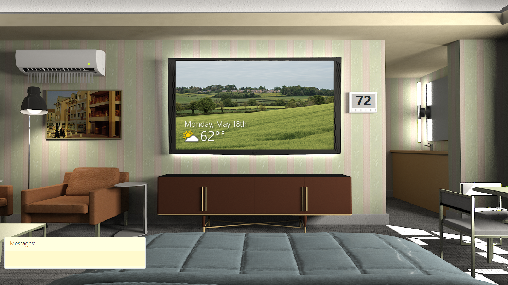

# Hospitality - A Custom Commands Demo

## Domain

In this demo we simulate a hotel room and use voice to control some of the devices in the room - The television, air-conditioning, blinds, bathroom lights and main-room light.

## Supported language

en-us

## Example sentences

Here are a few examples. Try these or others of your choice:
* Turn on the lights
* Turn off the bathroom lights
* Room lights off
* Turn off the AC
* Set the temperature to 71 degrees
* Raise the temperature
* Open the blinds
* Blinds down
* TV on
* Turn it off

If you configured your client application to listen for a keyword, say the keyword first followed by the above (or other) sentences (e.g. "computer, turn on the lights")

## Links

* To deploy this demo, follow the [step-by-step instructions for building a sample Voice Assistant using Custom Commands](../../../docs/CreateSampleVoiceAssistant.md)
* View the Custom Commands [JSON file](skill/en-us/HospitalityDemo.json) for this demo
