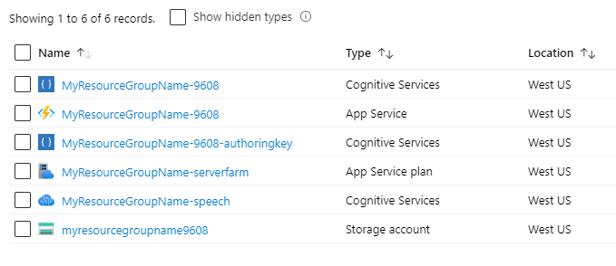
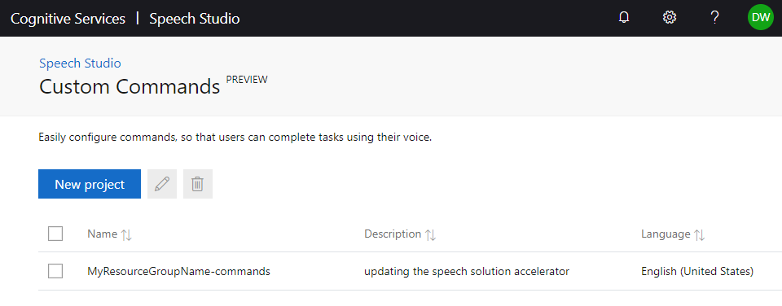

# Deploying a Sample Custom Command Application to Your Azure Subscription

<p align="center">UNDER DEVELOPMENT</p>

## Things you will need
* An Azure account. [Sign up for free](https://azure.microsoft.com/free/ai/).
* Powershell 6.0 or greater. [Download Powershell here](https://github.com/PowerShell/PowerShell/releases). 
    * On Windows, download and run an .msi file (e.g. "PowerShell-7.0.0-win-x64.msi")
* Azure CLI. [Insall Azure CLI](https://docs.microsoft.com/en-us/cli/azure/install-azure-cli?view=azure-cli-latest) version 2.4.0 or higher.
* .NET Core SDK 2.1 or higher. [Install SDK here](https://docs.microsoft.com/en-us/dotnet/core/install/sdk?pivots=os-windows).

## What are you deploying?
 
 TODO: Need diagram of CC and Visualization, and a description of the components and how they interact

## Deploying Azure resources
Open a command prompt and clone the repository if you have not done so already. Change directory to the custom commands deployment folder:
```cmd
    git clone https://github.com/Azure-Samples/Cognitive-Services-Voice-Assistant.git
    cd Cognitive-Services-Voice-Assistant\custom-commands\hospitality\deployment
```

Open a Powershell 6.0 or higher administrator prompt. You will need to unrestrict Powershell's script execution policy by running the following in an administrator Powershell:
```powershell
    Set-ExecutionPolicy -Scope Process -ExecutionPolicy Bypass
```
This will reset the policy once this Powershell session has ended.

Call az login to log your Powershell into Azure. If you have more than one Azure login credentials, you will be prompted to selected one or them:
```powershell
    az login
```
 Run the following Powershell script. 
 * Replace "MyResourceGroupName" with the an Azure Resource Group name of your choice. This name should be no more than 19 characters, alphanumeric only. Make sure an Azure resource group by this name does not already exist in your subscription. This name will also be used to construct names of all the Azure resources and URL that will be associated with this Custom Commands application and visualization. Some of these names need to be globally unique, so the script will append a random number to the name you selected
 * Replace "westus" with an Azure region near you, form the list of [Voice Assistant supported regions](https://docs.microsoft.com/en-us/azure/cognitive-services/speech-service/regions#voice-assistants). Read more about Azure Regions [here](https://azure.microsoft.com/en-us/global-infrastructure/regions/). Note that if you are using a free trial Azure subscription, you are limited to Azure regions westus or northeurope
```powershell
    ./deployAll.ps1 -resourceName MyResourceGroupName -region westus
```
It will take a few minutes for the scripts to run. 

If you see errors while running the script, refer to the [Troubleshooting](#troubleshooting) section below. Before running the script again due to errors, please [clean up your Azure resources and Github repo state](#cleaning-up-your-azure-resources-and-github-repo).

On a successful completion, you should see a message at the end similar to the following, with all the information you need to configure one of the selected Voice Assistant client samples, and a URL to visualize the results of your voice commands:
```console
***********************
Custom commands has been published.
Update these parameters in your client to use the Custom Commands Application
    CustomCommandsId = ########-####-####-####-############
    SpeechSubscriptionKey = ################################
    Speech Region = westus
***********************
To view your visualization go to this link.
    Visualization Endpoint = https://#########.blob.core.windows.net/www/demo.html?room=test1
***********************
```
Copy the above information and store it for later use (but you can always [retrieve it if needed](#retrieving-client-connection-information-and-visualization-URL))

If you now look at your [Azure Resource groups](https://portal.azure.com/#blade/HubsExtension/BrowseResourceGroups) in the Azure portal, you will see a new resource group has been created with the name you selected, with 6 resources in it, similar to what you see here:
<!-- Save this for reference, we may want to go back to a table and add descriptions...
| Name  | Type          |
| ------- | ---------------- |
| MyResourceGroupName-###  | Cognitive Services |
| MyResourceGroupName-### | App Service |
| MyResourceGroupName-###-authoringkey | Cognitive Services |
| MyResourceGroupName-serverfarm | App Service Plan |
| MyResourceGroupName-speech | Cognitive Services |
| MyResourceGroupName### | Storage account
-->
<p align="center">

</a>
</p>

## Make sure the visualization works properly

If you enter the visualization URL in your browser (```https://myresourcegroupname####.blob.core.windows.net/www/demo.html?room=test1```) you will see a default scene, simulating an environment you will soon manipulate with your voice.

For the Hospitality demo, you should see this scene:


## See your Custom Command application in Speech Studio

* Open [Speech Studio](http://speech.microsoft.com)
* Click on "Sign in" on the top right if you are not already signed in. Make sure you use the same Azure account you used to login from the Powershell script
* If you're prompted to select directory (Azure Active Directory for identity and access management), select the "Default Directory"
* If you're prompted to select a speech resource (*"Speech resources created on Azure are listed below. Choose one to begin a Speech Studio project"*), select the one named MyResourceGroupName-speech, which was created when you run the Powershell script. Then click on "Go to Studio".
* In the main Speech Studio page, go down to the bottom of the page and click on the "Custom Commands (PREVIEW)" box
* You should now see the newly created Custom Command project named MyResourceGroupName-commands, similar to the following:


Click on the project to open the Custom Command editor and have a look at the commands defined there. For more information about Custom Commands, see the "Develop with Custom Command" links in the [Voice Assistant documentation](https://docs.microsoft.com/en-us/azure/cognitive-services/speech-service/index-voice-assistants).

## Troubleshooting
The following are some common errors seen while executing the script:
* *<p style='color:red'>"The subscription '########-####-####-####-############' is disabled and therefore marked as read only. You cannot perform any write actions on this subscription until it is re-enabled.
Write-Error: Failed to create resource group"</p>* - This may be because your free trial period for Azure subscription has ended. Upgrade your subscription.
* *<p style='color:red'>"The template deployment 'azuredeploy' is not valid according to the validation procedure... See inner errors for details.... Operation failed. Only one free account is allowed for account type 'SpeechServices'....  Write-Error: Failed to deploy template"</p>* - The script uses the Azure free tier (F0) when deploying Cognitive Service Azure resources. In this tier there can only be one Speech resource per subscription. If you already deployed one Custom Command demo, and you are running the script again with a different resource group name, you will get this error. There are two ways to fix this:
  * [Delete the first Azure resource group](#cleaning-up-your-azure-resources-and-github-repo) before running another deployment script if you don't need both, or
  * Find the line ```"kind": "SpeechServices"``` in the file ```azuredeploy.json``` and change F0 to S0 above it. This will remove the limitation of single speech resource per subscription, but you may be charged for it.

## Retrieving client connection information and visualization URL

The values below were displayed when the deployment script finished running successfully. If you need to retrieve them, follow the instructions below.

These three values are needed in order to configure a [client application](https://github.com/Azure-Samples/Cognitive-Services-Voice-Assistant#sample-client-applications) to connect to the Custom Command service.:

* Speech subscription key and key region
    * Find the relevant [Azure resource group](https://portal.azure.com/#blade/HubsExtension/BrowseResourceGroups) and click on it to see all the resources in the group
    * There will be one resource named MyResourceGroupName-speech (of type Cognitive Services). Notice its region. Click on the resource name.
    * Click on "Keys and Endpoints" on the left menu. The value shown as "KEY 1" is the speech subscription key.  
* Custom Commands Application ID
    * [Log into the relevant Custom Command project](#see-your-custom-command-application-in-speech-studio) in speech studio.
    * Click on the Settings option, at the bottom of the left-side menu. You will see the Application ID there. Note that the Speech key can also be seen there ("show key")

The URL to visualize the voice command results is always in the form ```https://myresourcegroupname####.blob.core.windows.net/www/demo.html?room=test1```, where #### is the random number the deployment script created. You can see this number by looking at the resource names in your Azure portal. 

## Cleaning up your Azure resources and GitHub repo

When you run the script deployAll.ps1, a new Azure resource group is created, a few files on disk get automatically modified and a few new ones created. If you want to undo the effects of the script, follow the instructions below. Do that when you are done with this demo and want to clean things up. Also do the clean up if you encountered an error while running the script, and would like to re-run it. It's important to do clean up before you re-run the script.
1. Run this command in your Powershell prompt to delete the resource group (replace MyResourceGroupName with the name you picked):
```powershell
az group delete --name MyResourceGroupName
```

## Deploying Azure resources - deep dive

*This section needs to be updated.*

First an Azure resource group was created using the resourceName parameter as the name.

Then resources were created using an azure template which is stored in the [./azuredeploy.json](./azuredeploy.json) file. Parameters were passed in from the powershell script by manipulation the json values in the [./azuredeploy.parameters.json](./azuredeploy.parameters.json) file. For the individual resources a random number between 0 and 9999 is attached to help guarantee availability.</br>

The values set in the azuredeploy.json file determine many things like pricing scheme, dependencies, and others.

These are the resources specified in the azuredeploy.json:
* Language Understanding (LUIS)
* Language Understanding Authoring
* Speech
* Storage Account
* App Service Plan
* Function App (CORS policy specified as "\*". Further reading: [CORS](https://en.wikipedia.org/wiki/Cross-origin_resource_sharing))

There are some links between resources that we must update. So we do a simple string replace in the powershell script to connect the demo.html file in the storage account to the azure function and to connect the function to the storage to be able to update tables.

Once the resources we need are deployed and our files are updated, we must fill the storage account with the files used in the visualization. These are stored in the repo under [../storage files](../storage-files).

We give the calling user the Storage Blob Data Reader and Contributor roles. Then we push the files to the resource.

After that the azure function project located in [../skill](../skill) was built using the command line .NET tool and deployed to the Azure function resource.

The Custom Commands application was created from the json file [../skill/hospitalityCustomCommands.json](../skill/hospitalityCustomCommands.json) and deployed using your Azure subscription. You can view that service in the [Microsoft Speech Portal](https://speech.microsoft.com/).

Our Powershell deployment script is intended to make getting started easier. For further customization you should edit the Powershell scripts to fit your needs.

Another useful thing might be to update the SKU's in the azuredeploy.json to allow higher usage and other things such as multiple speech resources, and App Service plans in different regions. The script has a region check for the supported regions of the free App Service plan, which will need to be removed if you do this.

