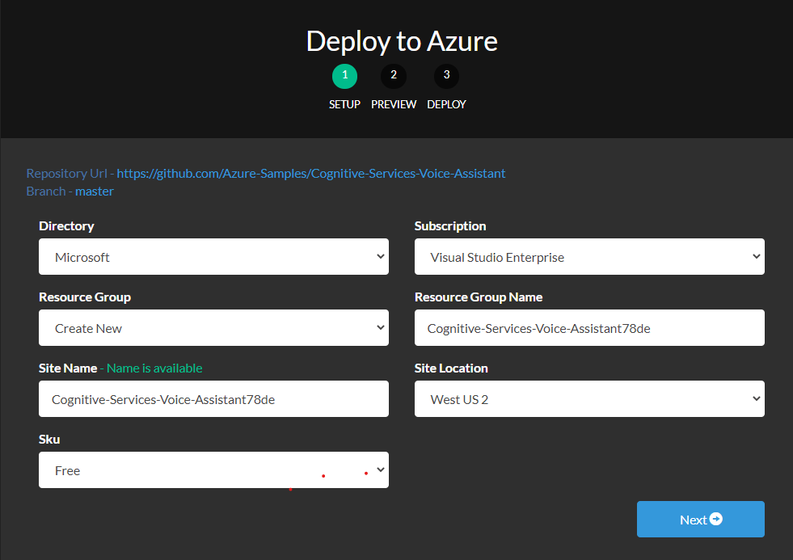

This README is under development and not guaranteed to be accurate or functional.

## Things you will need
* An Azure subscription. [Azure](https://portal.azure.com)
* Powershell 6.0 or greater [Download Powershell](https://github.com/PowerShell/PowerShell/releases)

## Deploying Azure Resources
1. Click the button below:   

2. A new window should pop up that prompts you to log into your Azure account. 

3. Once logged in, input the desired values in the fields. For this README we will create a new resource group. 
Keep track of the Site Name you use. We will need it later.

4. Click "Next" at the bottom of the page.

5. Click "Deploy"

6. You're resources should be deployed

7. In the Azure portal you should now have a resource group and some resources underneath it. You will need the following resources to use further down.
* LUIS authoring key.
* speech subscription key.
* azure subscription key. - look for Subscriptions in Azure and you should be able to find it.
* site name from earlier.
* website for task completion. In our case this is the hospitality room website.

## Deploying your Custom Commands Application
1. Open a powershell window and cd into the deployment directory
2. run .\createSpeechApp.ps1 with the following parameters:
* -speechResourceKey YOUR_SPEECH_SUBSCRIPTION_KEY
* -siteName SITENAME_USED_IN_DEPLOYING
* -azureSubscriptionId AZURE_SUBSCRIPTION_ID 
* -luisAuthoringKey LUIS_AUTHORING_KEY
* -websiteAddress WEBSITE_FOR_TASK_COMPLETION

It should look something like this:

    .\createSpeechApp.ps1 -speechResourceKey YOUR_SPEECH_SUBSCRIPTION_KEY -websiteAddress WEBSITE_FOR_TASK_COMPLETION -siteName SITENAME_USED_IN_DEPLOYING -azureSubscriptionId AZURE_SUBSCRIPTION_ID  -luisAuthoringKey LUIS_AUTHORING_KEY