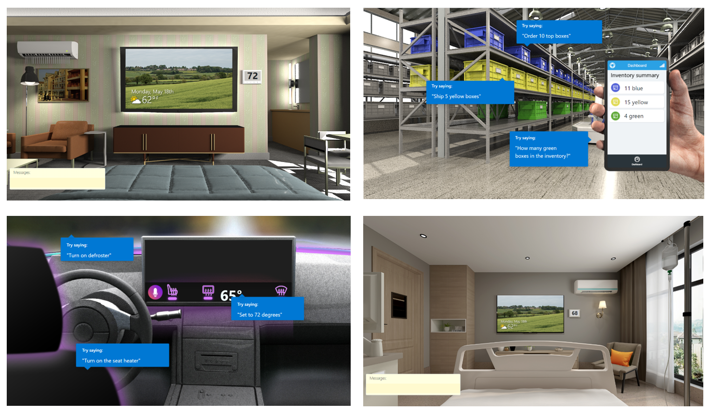

# Step-by-Step Instructions for Building a Sample Voice Assistant using Custom Commands

<p align="center">
<a href="https://docs.microsoft.com/en-us/azure/cognitive-services/speech-service/custom-commands">

</a>
</p>

This page will guide you through building a sample [Voice Assistant](https://docs.microsoft.com/en-us/azure/cognitive-services/speech-service/voice-assistants) using Microsoft's [Custom Commands](https://docs.microsoft.com/en-us/azure/cognitive-services/speech-service/custom-commands). After following the steps below you will have:
* A new Azure resouces group deployed to your Azure subscription, and a new Custom Command project in your [Speech Studio](https://speech.microsoft.com/portal/66e6e1b725074035a9e4cfea48eae6e6) portal
* A sample client application running, configured to connect to your Custom Command service and voice activated by a keyword of your choice
* You will be able to speak to your device, issue commands, get spoken confirmation from the voice assistant (or it will ask you follow up questions), and see the resulting simulated actions displayed on a web page

## Step 1 - Watch this 12 minute overview video

<p align="center">
<a href="https://www.youtube.com/watch?v=1zr0umHGFyc">

</a>
</p>

## Step 2 - Select a Custom Command demo

<p align="center">

</p>

We have four demos for you to select from. Read about what voice commands they support and see the associated visualization. When you selected the one you would like to deploy, continue to Step 3
* [Hospitality demo](../custom-commands/demos/hospitality/README.md) (language: en-us)
* [Inventory management demo](../custom-commands/demos/inventory/README.md) (language: en-us)
* [Automotive demo](../custom-commands/demos/automotive/README.md) (language: en-us)
* [Care room demo](../custom-commands/demos/careroom/README.md) (language: en-us)


## Step 3 - Run the Azure deployment script

Run a Powershell script to deploy all the Azure resources needed for your selected demo, in your own Azure subscription. The script will also create and provision the selected Custom Command project.

[Follow the instructions here](../custom-commands/demos/README.md).

At the end of this step, you will have the following values:
* Azure Cognitive Services Speech subscription key (e.g. ```b587d36063dd458daea151a1b969720a```)
* Subscription key region (e.g. ```westus```)
* Custom Commands application ID (e.g ```32d06e92-1bd0-4f3f-2c3b-8cf036d0518f```)
* URL for visualization (e.g. ```https://myresourcegroupname1027.blob.core.windows.net/www/demo.html?room=test1```)

## Step 4 - Select a keyword (optional)

You can configure a client application to always be listening for a keyword of your choice, and respond to your voice commands after the keyword has been spoken. This is optional, the alternative being pressing a microphone button or key on your keyboard before speaking.

To configure keyword activation, you will need to have a keyword model file, which is a binary file with .table extension. We have a few .table files ready for you to use, or you can create a new one for your own keyword.

[Follow the instructions here](https://github.com/Azure-Samples/Cognitive-Services-Voice-Assistant/tree/master/keyword-models)

At the end of this step, you will have a .table file if you want keyword activation in your demo (e.g. ```contoso.table```)

## Step 5 - Select a client application and run the demo

* Select one of the [sample client applications](https://github.com/Azure-Samples/Cognitive-Services-Voice-Assistant#sample-client-applications) in this repo.
* Follow the instructions there to download the executable or build it from source code. 
* Configure it by editing a JSON file and entering the values you have from Step 3 (speech subscription key, key region & Custom Commands application ID) and the optional .table file name from Step 4. This will enable your client application to connect to your Custom Command service. 
* Open a web browser and enter the URL you have from Step 3. This is where you will see a visualization of your voice command results
* Run the client application and try out several voice commands, while viewing the results in the visualization web page.

If you are developing on windows, we recommend you first use the [Windows Voice Assistant Client](https://github.com/Azure-Samples/Cognitive-Services-Voice-Assistant/tree/master/clients/csharp-wpf). Executable of the latest stable version can be downloaded from the [Release tab](https://github.com/Azure-Samples/Cognitive-Services-Voice-Assistant/releases) (no need to compile code). It has nice GUI to configure connection settings.

If you are in the IoT space, you can create a compelling demo by running the [sample C++ code](https://github.com/Azure-Samples/Cognitive-Services-Voice-Assistant/tree/master/clients/cpp-console) on a Raspberry Pi device. This includes the option to install the Microsoft Audio Stack to enable echo-cancellation and noise suppression, allowing far-field voice interaction and "barge-in" keyword activation (interrupting the Voice Assistant while it's speaking)

## Step 6 - Give us feedback!

We would like to hear your feedback on these demos. If you had trouble getting any of the above steps to work and need assistant, or simply want to suggest improvements, please open a new GitHub issue. [Open this link](https://github.com/Azure-Samples/Cognitive-Services-Voice-Assistant/issues) and click on "New Issue". We will respond to every issue.

Thank you!

Microsoft Speech Services team
