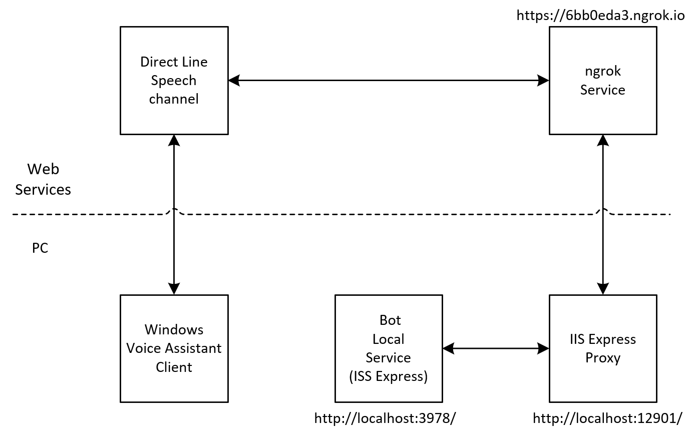

# Running & debugging your Bot locally while using Direct Line Speech Channel

This assumes:
* You have a Visual Studio project of a bot, that has been modified to work with Direct Line Speech channel by adding suppot for [web sockets](https://docs.microsoft.com/en-us/azure/bot-service/directline-speech-bot?view=azure-bot-service-4.0)
* You would like to run your bot as a local host service on your PC, and debug your bot source code by putting breakpoints and stepping through the code
* You have a client application that uses Speech SDK to manage communication with your bot. This could be your own application or any one of the [client sample code in this repo](https://github.com/Azure-Samples/Cognitive-Services-Voice-Assistant/tree/master/clients). In this article we will assume you are using [Windows Voice Assistant Client](https://github.com/Azure-Samples/Cognitive-Services-Voice-Assistant/tree/master/clients/csharp-wpf) as your client application


We will use [ngrok](https://ngrok.com/) web service to expose a public URL, which we will register as the Bot messaging URL. Traffic to that URL will be redirected by ngrok web service to your local machine.

Visual Studio uses ISS Express to host your bot as a local service. ISS Express does not allow in-coming web-socket connections from external machines. Since Direct Line Speech channel uses web-socket to connect to the Bot, we need use a proxy. Note that you will typically not need a proxy for Bots written in Node JS. Node is the runtime that will host the service locally, and it does not have that issue.

We need to run ISS Express proxy between ngrok service and the local bot service, so they can communicate using web-sockets as shown in this diagram (URLs are example only):
<p align="center">

</p>


## Steps:

1. Do this once to get ngrok setup:
    * Download the [ngrok zip file](https://ngrok.com/download) and unzip it to a folder on your desktop. It will only contain one file: ngrok.exe
    * To route HTTPS traffic with ngork, you must sign-in on the ngrok website and get an auth token that you will install locally. [Sign up here](https://dashboard.ngrok.com/signup)
    * After you log in there will be a section titled "connect your account", with a command line like this: ```ngrok authtoken xxxxxxxx``` 
    * Open a command prompt where ngrok.exe is and type the above command. You should get a message like this if everything is okay: ```Authtoken saved to configuration file: C:\Users\<<userid>>/.ngrok2/ngrok.yml```

1. In Visual Studio, run your project (F5) to deploy your bot locally. Note the Bot messaging address (typically http://localhost:3978/api/messages. We will assume that's the URL from here on)

1. Set up a proxy on your PC, by opening a command prompt and typing:
    * ```npm install -g iisexpress-proxy``` (you only need to do this once)
    * ```iisexpress-proxy 3978 to 12901```  (note that port 12901 was picked arbitrarily)

1. Open another command prompt, and run ngrok:
    * ```ngrok.exe http 12901```
    * Note the https ngrok web address in the console printout (e.g. "Forwarding https://6bb0eda3.ngrok.io -->". We will assume that's the URL from here on).

1. Go to your [Azure portal](https://portal.azure.com) and find your bot's "Bot Channel Registration" or "Web App Bot" resource (whichever you use)
    * Update the messaging end-point to what you got from ngrok. Don't forget to add the /api/messages). For example: https://6bb0eda3.ngrok.io/api/messages
    * Remember to check the box "Enable Streaming Endpoint"
    * Register it with Direct Line Speech channel if you have not yet done so

1. Install [Windows Voice Assistant client](https://github.com/Azure-Samples/Cognitive-Services-Voice-Assistant/tree/master/clients/csharp-wpf) tool if you don't already have it. You can either build it from source code or [download a package](https://github.com/Azure-Samples/Cognitive-Services-Voice-Assistant/releases) that contain the executable (VoiceAssistantClient.exe)

1. Open the tool and create a new connection profile by entering the speech key used to register the bot with Direct Line Speech channel and the speech key region. Save and apply the profile
    
1. You are now ready to debug:
    * In your bot's Visual Studio project, put a breakpoint in your bot source code and start the debugger. You bot is now running as local host waiting for a call
    * In Windows Voice Assistant client, press the microphone button and start speaking, or enter text in the text bar. This should result in your bot getting a Bot-Framework Activity from Direct Line Speech channel and your breakpoint being hit allowing you to step through your bot code 

## Related links

* BF blog [Debug any Channel locally using ngrok](https://blog.botframework.com/2017/10/19/debug-channel-locally-using-ngrok/)
* [ISS Express Overview](https://docs.microsoft.com/en-us/iis/extensions/introduction-to-iis-express/iis-express-overview)
* [ISS Express Proxy on GitHub](https://github.com/icflorescu/iisexpress-proxy)
* StackOverflow: [Exposing localhost to the internet via tunneling (using ngrok): HTTP error 400: bad request; invalid hostname](https://stackoverflow.com/questions/30535336/exposing-localhost-to-the-internet-via-tunneling-using-ngrok-http-error-400)

##  Feedback

Please provide feedback on the instruction above by opening [a new GitHub issue](https://github.com/Azure-Samples/Cognitive-Services-Voice-Assistant/issues/new)
